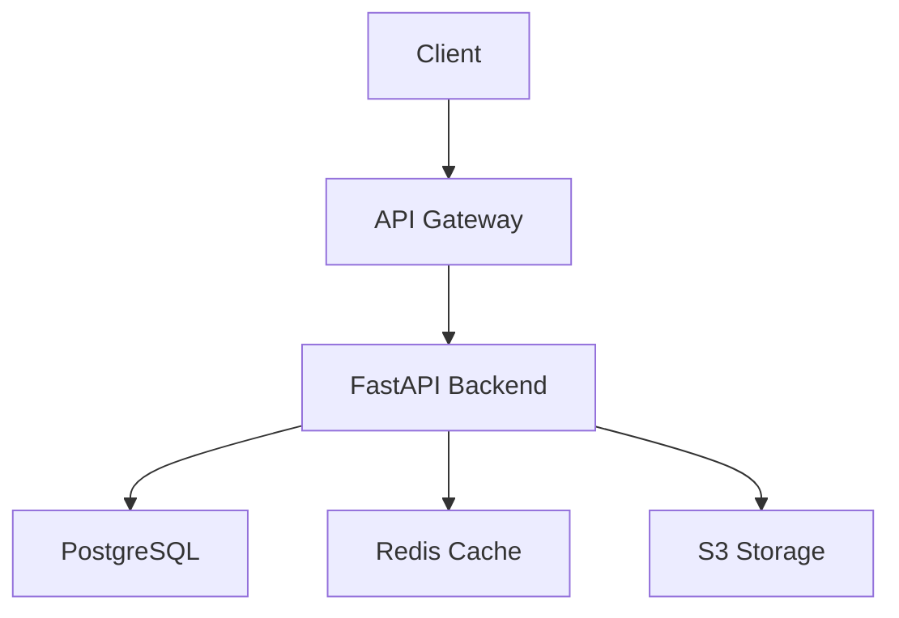

# Project Alpha

#project #active #python #priority/high

## Overview
Project Alpha is our flagship Python application that provides automated data processing capabilities for our clients.

**Status**: 🟡 In Progress (65% complete)
**Due Date**: February 15, 2024
**Budget**: $50,000

## Team Members
- [[John Doe]] - Lead Developer
- [[Jane Smith]] - Backend Developer  
- [[Bob Wilson]] - QA Engineer

## Technical Stack
- Python 3.11
- FastAPI
- PostgreSQL
- Docker
- AWS

See [[Resources/Python Guide]] for coding standards.

## Milestones

### Phase 1: Planning (Complete)
- [x] Requirements gathering
- [x] Technical design document
- [x] Architecture review

### Phase 2: Development (In Progress)
- [x] Setup development environment
- [x] Database schema design
- [x] Complete API design
- [ ] Write unit tests
- [ ] Implement core features
- [ ] Deploy to staging

### Phase 3: Testing & Deployment
- [ ] Integration testing
- [ ] Performance testing
- [ ] Security audit
- [ ] Production deployment

## Current Sprint Tasks
- [ ] Complete user authentication module
- [ ] Implement data validation layer
- [ ] Create API documentation
- [ ] Setup CI/CD pipeline

## Architecture



## Code Examples

### API Endpoint Structure
```python
from fastapi import APIRouter, Depends, HTTPException
from sqlalchemy.orm import Session

router = APIRouter(prefix="/api/v1")

@router.get("/projects/{project_id}")
async def get_project(
    project_id: int,
    db: Session = Depends(get_db),
    current_user: User = Depends(get_current_user)
):
    project = db.query(Project).filter(Project.id == project_id).first()
    if not project:
        raise HTTPException(status_code=404, detail="Project not found")
    return project
```

### Database Model
```python
from sqlalchemy import Column, Integer, String, DateTime, ForeignKey
from sqlalchemy.ext.declarative import declarative_base

Base = declarative_base()

class Project(Base):
    __tablename__ = "projects"
    
    id = Column(Integer, primary_key=True)
    name = Column(String, nullable=False)
    status = Column(String, default="planning")
    created_at = Column(DateTime, default=datetime.utcnow)
    owner_id = Column(Integer, ForeignKey("users.id"))
```

## Meeting Notes
- [[Meetings/2024-01-15 Project Sync]]
- [[Meetings/2024-01-08 Architecture Review]]
- [[Meetings/2024-01-01 Kickoff Meeting]]

## Resources
- [[Resources/API Design Guidelines]]
- [[Resources/Python Best Practices]]
- [[Resources/Testing Strategy]]

## Risks and Mitigations
1. **Timeline Risk**: Tight deadline for February release
   - Mitigation: Prioritize core features, defer nice-to-haves
2. **Technical Debt**: Legacy system integration
   - Mitigation: Create abstraction layer, plan refactoring sprint

## Related Projects
- [[Projects/Project Beta]] - Integration planned for Q2
- [[Projects/Legacy System Migration]] - Dependency for data import

#project-management #roadmap